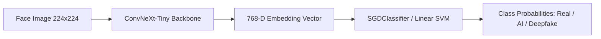

# Real, Deepfake or AI Classifier (ConvNeXt + Linear/RBF SVM)

An end-to-end computer vision and machine learning pipeline to classify human face images as **Real**, **AI Generated**, or **Deepfake**.

---

## 🧠 Architecture Overview

The system uses an efficient two-stage transfer learning architecture:



1. **Feature Extraction**: A pre-trained `ConvNeXt-Tiny` vision backbone extracts 768-dimensional dense visual representations.
2. **Classification**: A calibrated linear SGD / Support Vector Machine (SVM) classifies embeddings in feature space with fast training and near-instant inference.

---

## 📂 Project Structure

```text
├── config.py                 # Central configuration, dynamic dataset discovery, and device settings
├── utils.py                  # ConvNeXt loader, transform pipeline, batch extraction via DataLoader
├── preprocess.py             # High-throughput batched image feature extraction to .npy files
├── train.py                  # Training, evaluation, calibration, and metric plotting (ROC, Confusion Matrix)
├── predict.py                # Command-line & interactive single-image inference
├── visualize_boundaries.py   # 2D LDA projection and proxy SVM decision boundary visualizer
├── dataset_split.py          # Group-aware (video/subject-level) train/test splitter preventing data leakage
├── crop.py                   # Proportional, non-destructive face center-cropping utility
├── nano_banana.py            # Synthetic face generator using Google Gemini & Nano-Banana models
├── requirements.txt          # Python dependencies
├── SGD_ConvNeXt_nano.pkl     # Pre-trained classifier weights
└── gemini.env.example        # Environment variable template for Gemini API key
```

---

## 🚀 Setup & Installation

### 1. Clone & Set Up Environment
```bash
git clone <repo-url>
cd "Real, Deepfake or AI (ConvNeXt)"

# Create and activate virtual environment
python3 -m venv .venv
source .venv/bin/activate

# Install dependencies
pip install -r requirements.txt
```

### 2. Configure API Key (Optional, for synthetic image generation)
```bash
cp gemini.env.example gemini.env
# Edit gemini.env and set your Google Gemini API key:
# API_KEY=your_key_here
```

---

## 💻 CLI Usage Guide

### 1. Inference / Prediction (`predict.py`)
Classify an individual face image directly from the command line:

```bash
# Pass an image directly
python predict.py --image path/to/face.jpg

# Or pass a name from dataset/t_images/
python predict.py --image test.jpg

# Or run interactively (prompts for input)
python predict.py
```

Sample output:
```text
=============================================
           PREDICTION RESULTS
=============================================
File:       /path/to/t_images/test.jpg
Prediction: REAL
Confidence: 90.3%

Class Probabilities:
  [0] Real       :  90.3%  ##################
  [1] AI Fake    :   9.7%  #
  [2] Deepfake   :   0.0%  
=============================================
```

### 2. Train or Evaluate (`train.py`)
Train a new classifier on precomputed embeddings or evaluate an existing checkpoint:

```bash
# Evaluate existing pre-trained model (saves plots to outputs/)
python train.py --classifier sgd

# Train a new SGD classifier with balanced class weighting
python train.py --classifier sgd --train

# Train an RBF kernel SVM
python train.py --classifier rbf --train
```

Outputs generated in `outputs/`:
- `<model>_Confusion_Matrix.png`
- `<model>_ROC_Curves.png`
- `<model>_Classification_Report.txt`

### 3. Feature Extraction (`preprocess.py`)
Extract 768-D embeddings from image directories in batches using PyTorch `DataLoader`:

```bash
python preprocess.py --batch-size 64 --num-workers 4
```

### 4. Leakage-Free Dataset Splitting (`dataset_split.py`)
Split a directory of images into `{name}-train` and `{name}-test`. When processing video frames (e.g. FaceForensics++), it automatically groups frames by video ID so no frames from the same video are leaked across splits:

```bash
python dataset_split.py --folder dataset/deepfake/face2face --train-ratio 0.8 --seed 42
```

### 5. Decision Boundary Visualization (`visualize_boundaries.py`)
Project 768-D features to 2D using Linear Discriminant Analysis (LDA) and plot the decision surfaces:

```bash
python visualize_boundaries.py --kernel rbf --samples 1000
```
Saves `RBF_Decision_Boundary.png` to `outputs/`.

---

## 📊 Pre-trained Model & Benchmarks

The repository includes a pre-trained checkpoint: **`SGD_ConvNeXt_nano.pkl`**.

| Metric | Real (0) | AI Fake (1) | Deepfake (2) | Macro Avg |
| :--- | :---: | :---: | :---: | :---: |
| **Precision** | 99.5% | 89.5% | 99.7% | 96.2% |
| **Recall**    | 97.7% | 97.9% | 99.8% | 98.5% |
| **F1-Score**  | 98.6% | 93.5% | 99.8% | 97.3% |
| **Overall Accuracy** | \multicolumn{4}{c}{**98.66%** (11,493 test samples)} |

---

## 🎓 Academic & Scientific Considerations

When presenting or citing this work for academic research or university evaluation:

1. **Video-Level vs. Frame-Level Splitting**: In video deepfake datasets (e.g., FaceForensics++), frame-level random splitting causes temporal leakage because adjacent frames from the same video share identical lighting, subject identity, and background. To test real-world generalization, splits must group frames strictly by video or subject identity using `dataset_split.py`.
2. **Domain Bias & Confounder Generalization**: In multi-source datasets, models can learn to distinguish dataset signatures (e.g., FaceForensics H.264 video compression vs. CelebA JPEG quantization vs. StyleGAN frequency fingerprints) rather than universal facial anomalies. Cross-dataset testing on unseen in-the-wild videos is recommended for production deployments.
3. **Dimensionality Reduction Disclaimer**: The 2D boundary plots produced by `visualize_boundaries.py` represent a proxy model fitted on a 2D LDA projection for qualitative cluster analysis, while the true classification decision boundaries operate across 768 dimensions.
